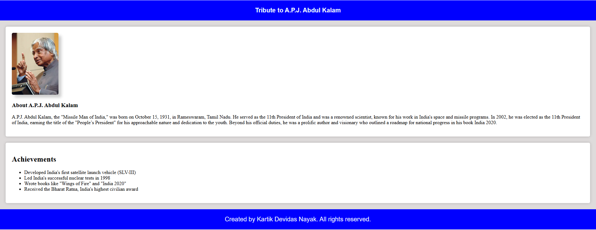
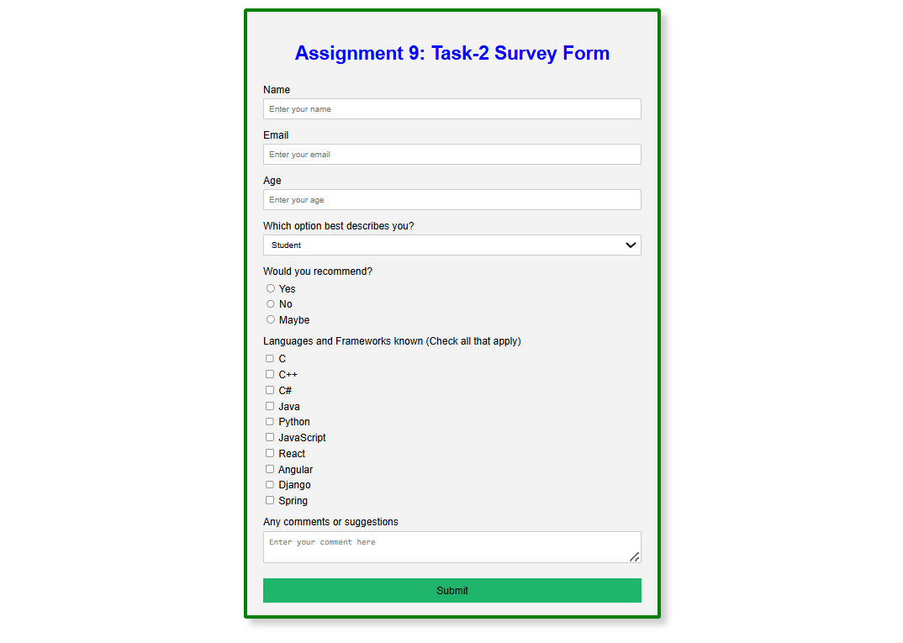
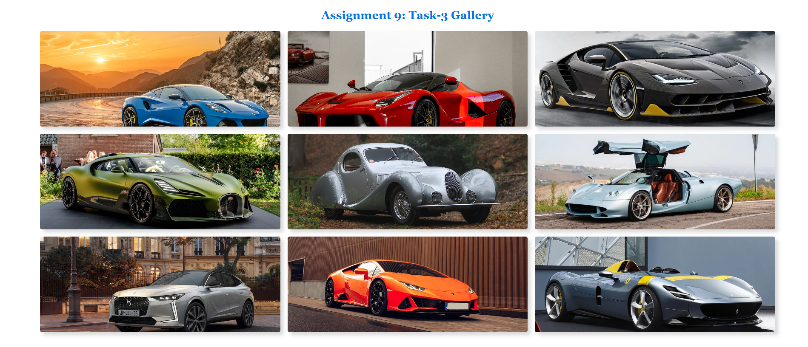

# Assignment 9 – Full Stack Java Tasks

This repository contains assignment 9 in three parts built using **HTML and CSS**.

---

## 📁 Folder Structure

### 🔹 assignment9.1

## 📸 Project Preview

---

### 🔹 assignment8.2

## 📸 Project Preview

---

### 🔹 assignment8.2

## 📸 Project Preview

---

## 🚀 How to Run Locally

1. Clone the repository
2. Open any folder
3. Run index.html in browser

---

## 🛠 Technologies Used
- HTML5
- CSS3

---

## Author
Kartik Nayak
